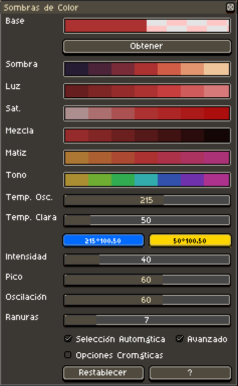
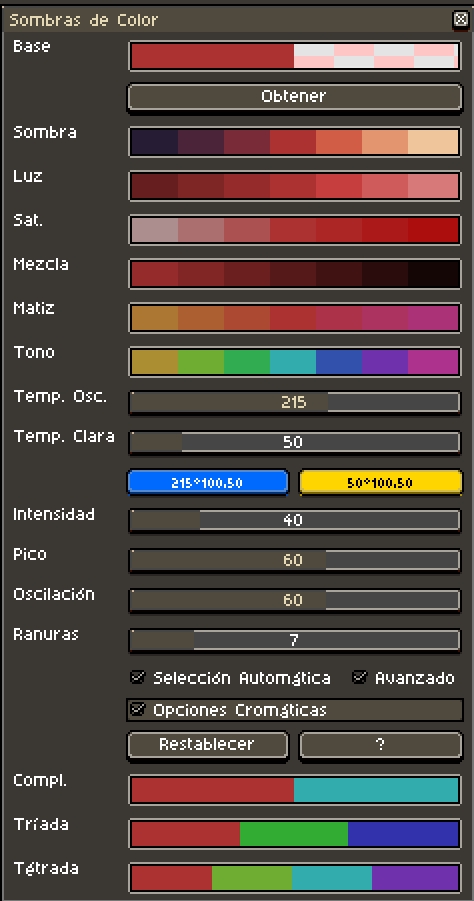
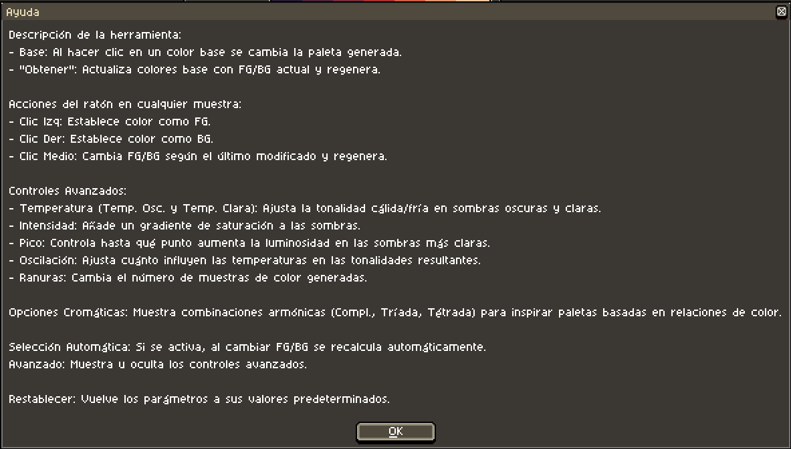

# Aseprite Color Shading v5.0

Este script para [Aseprite](https://www.aseprite.org/) abre una ventana dinámica de selección de color con opciones de gradiente y tono, ayudándote a crear fácilmente paletas y variaciones de sombreado.

## Créditos y orígenes

Este trabajo se basa en contribuciones previas:

- Versión 1.0–2.0 por [Dominick John](https://github.com/dominickjohn/aseprite/tree/master) y [David Capello](https://aseprite.org/).
- Versión 3.0 por [yashar98](https://github.com/yashar98/aseprite/tree/main).
- Versión 3.1 por [Daeyangae](https://github.com/Daeyangae/aseprite).
- Versión 4.0 por [Manuel Hoelzl](https://github.com/hoelzlmanuel/aseprite-color-shading).

Esta versión mantiene las funcionalidades introducidas anteriormente mientras añade mejoras adicionales.

## Instalación

1. Descarga el archivo del script (por ejemplo, `Color Shading v4.0.lua`).
2. Abre Aseprite y ve a **Archivo -> Scripts -> Abrir carpeta de scripts** para abrir el directorio de scripts.
3. Copia el archivo del script en la carpeta de scripts de Aseprite.
4. Reinicia Aseprite si es necesario.

## Uso

1. En Aseprite, ve a **Archivo -> Scripts -> Color Shading v4.0** para ejecutar el script.
2. Aparecerá una ventana con diferentes secciones de color y opciones para generar paletas.

### Funcionalidades:

- **Base:** Al hacer clic en uno de los colores base, se recalculan los demás tonos y matices basados en ese color.
- **Botón "Obtener":** Actualiza los colores base usando los colores actuales de primer plano (FG) y fondo (BG), y regenera los tonos.
- **Clic izquierdo en un color:** Establece ese color como FG.
- **Clic derecho en un color:** Establece ese color como BG.
- **Clic medio en un color:** Alterna entre FG/BG dependiendo de cuál se haya cambiado por última vez (si "auto obtener" está habilitado), y regenera todos los tonos basados en el nuevo color.
  
### Controles avanzados:

- **Temperatura (Oscuro/Claro):** Ajusta los desplazamientos cálidos/fríos para sombras oscuras y claras, respectivamente.
- **Intensidad:** Añade un gradiente de saturación a los tonos.
- **Pico:** Añade un gradiente de luminosidad a los tonos, afectando cuán brillantes se vuelven las muestras claras.
- **Oscilación:** Ajusta cuánto influyen las temperaturas en los colores resultantes.
- **Slots:** Cambia el número de muestras de color generadas.

## Notas

- Asegúrate de tener la última versión de Aseprite para garantizar compatibilidad con el script.
- Este script está pensado para artistas pixel y diseñadores que necesitan herramientas para generar paletas y gradientes de color rápidamente.

## 🌐 Otros idiomas

- 🇬🇧 [Versión en inglés](../../README.md)
- 🇫🇷 [Versión en francés](README-FR.md)
- 🇯🇵 [Versión en japonés](README-JA.md)
- 🇵🇹 [Versión en portugués](README-PT.md)
