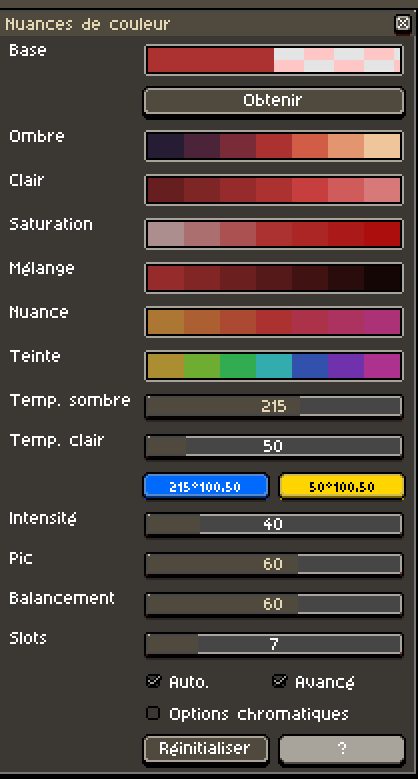
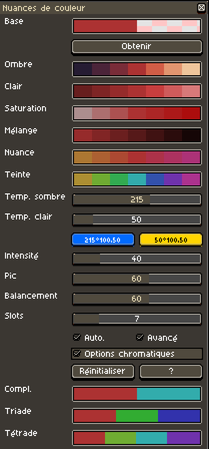
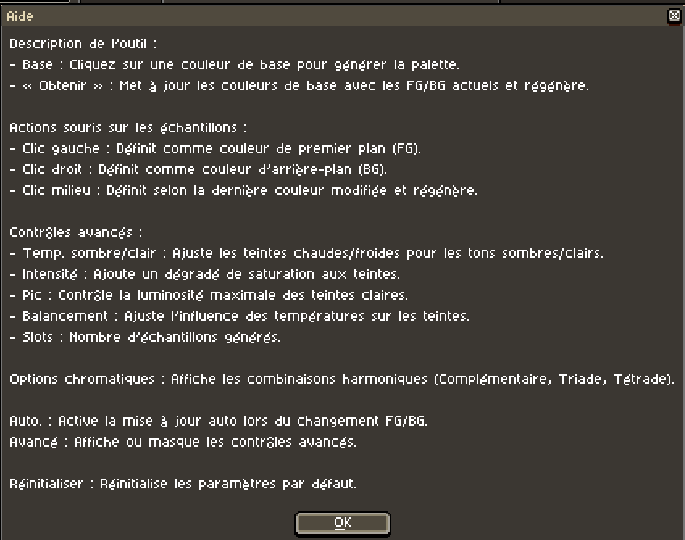

# Aseprite Color Shading v5.0

Ce script pour [Aseprite](https://www.aseprite.org/) ouvre une fenêtre dynamique de sélection de couleurs avec des options de dégradé et de teinte, vous aidant à créer facilement des palettes et des variations d'ombrage.

## Crédits et origines

Ce travail est basé sur des contributions précédentes :

- Version 1.0–2.0 par [Dominick John](https://github.com/dominickjohn/aseprite/tree/master) et [David Capello](https://aseprite.org/).
- Version 3.0 par [yashar98](https://github.com/yashar98/aseprite/tree/main).
- Version 3.1 par [Daeyangae](https://github.com/Daeyangae/aseprite).
- Version 4.0 par [Manuel Hoelzl](https://github.com/hoelzlmanuel/aseprite-color-shading).

Cette version conserve les fonctionnalités introduites précédemment tout en ajoutant des améliorations supplémentaires.

## Installation

1. Téléchargez le fichier du script (par exemple, `Color Shading v4.0.lua`).
2. Ouvrez Aseprite et allez dans **Fichier -> Scripts -> Ouvrir le dossier des scripts** pour accéder au répertoire des scripts.
3. Copiez le fichier du script dans le dossier des scripts d’Aseprite.
4. Redémarrez Aseprite si nécessaire.

## Utilisation

1. Dans Aseprite, allez dans **Fichier -> Scripts -> Color Shading v4.0** pour exécuter le script.
2. Une fenêtre avec différentes sections de couleur et options de génération de palette apparaîtra.

### Fonctionnalités :

- **Base :** Cliquer sur une couleur de base recalcule les autres teintes et nuances en fonction de cette couleur.
- **Bouton "Obtenir" :** Met à jour les couleurs de base en utilisant les couleurs actuelles de premier plan (FG) et d'arrière-plan (BG), puis régénère les teintes.
- **Clic gauche sur une couleur :** Définit cette couleur comme FG.
- **Clic droit sur une couleur :** Définit cette couleur comme BG.
- **Clic milieu sur une couleur :** Alterne entre FG/BG selon la dernière couleur modifiée (si "auto" est activé), et régénère toutes les teintes avec la nouvelle couleur.
  
### Contrôles avancés :

- **Température (Sombre/Clair) :** Ajuste les variations chaudes/froides pour les ombres sombres et claires.
- **Intensité :** Ajoute un dégradé de saturation aux échantillons de teintes.
- **Pic :** Ajoute un dégradé de luminosité aux teintes, affectant la luminosité des tons clairs.
- **Balancement :** Ajuste l'influence des températures sur les couleurs finales.
- **Slots :** Modifie le nombre d'échantillons de couleur générés.

## Remarques

- Assurez-vous d'utiliser la dernière version d’Aseprite pour garantir la compatibilité.
- Ce script est destiné aux pixel artists et designers qui ont besoin d'outils pour générer rapidement des palettes et des dégradés.

## 🌐 Autres langues

- 🇬🇧 [Version anglaise](../../README.md)
- 🇪🇸 [Version espagnole](README-ES.md)
- 🇯🇵 [Version japonaise](README-JA.md)
- 🇵🇹 [Version portugaise](README-PT.md)
