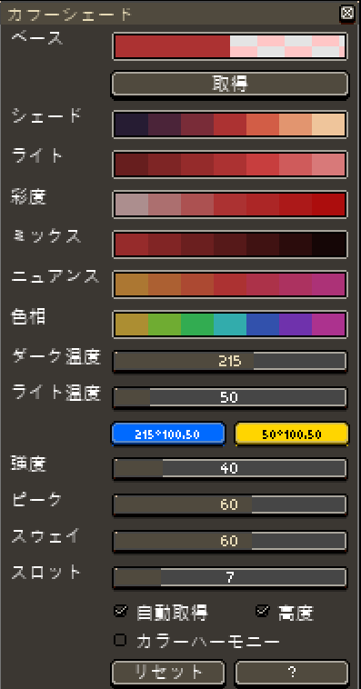
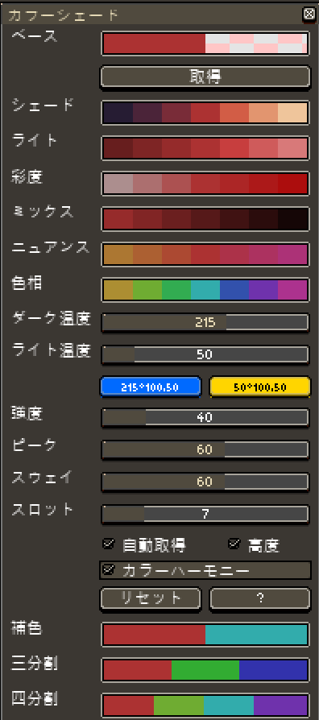
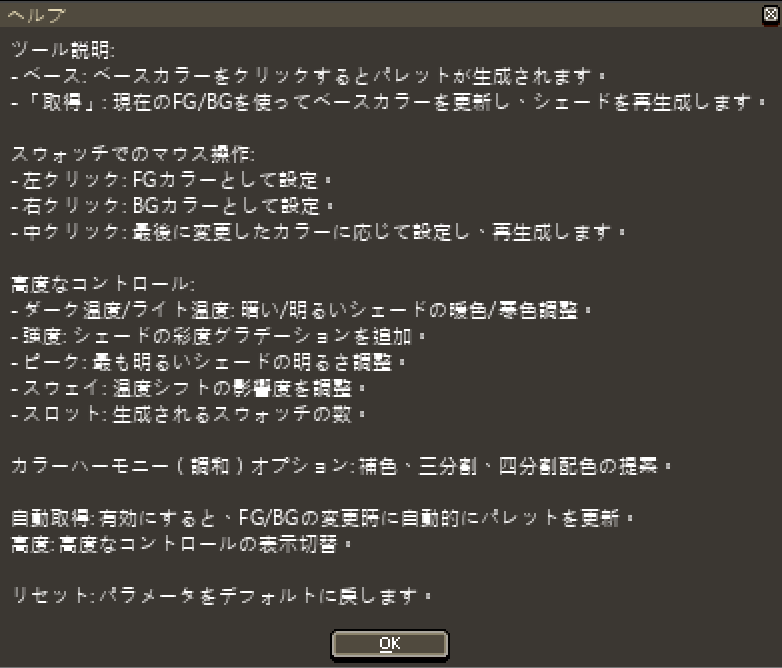

# Aseprite カラーシェーディング v5.0

このスクリプトは [Aseprite](https://www.aseprite.org/) 用で、グラデーションや色相オプションを備えた動的なカラーパレットウィンドウを開き、簡単にパレットやシェーディングバリエーションを作成するのに役立ちます。

## クレジットと由来

この作品は、以下の以前の貢献に基づいています：

- バージョン 1.0–2.0: [Dominick John](https://github.com/dominickjohn/aseprite/tree/master) と [David Capello](https://aseprite.org/)。
- バージョン 3.0: [yashar98](https://github.com/yashar98/aseprite/tree/main)。
- バージョン 3.1: [Daeyangae](https://github.com/Daeyangae/aseprite)。
- バージョン 4.0: [Manuel Hoelzl](https://github.com/hoelzlmanuel/aseprite-color-shading)。

このバージョンは、これまでに導入された機能を維持しながら、さらに改善を加えています。

## インストール方法

1. スクリプトファイルをダウンロードします（例: `Color Shading v4.0.lua`）。
2. Aseprite を開き、**ファイル -> スクリプト -> スクリプトフォルダを開く** を選択してスクリプトフォルダを開きます。
3. ダウンロードしたスクリプトファイルをそのフォルダにコピーします。
4. 必要に応じて Aseprite を再起動します。

## 使い方

1. Aseprite で **ファイル -> スクリプト -> Color Shading v4.0** を選択してスクリプトを実行します。
2. カラーセクションやパレット生成オプションを含むウィンドウが表示されます。

### 機能：

- **ベース:** ベースカラーをクリックすると、それを基に他のシェードやニュアンスが再計算されます。
- **「取得」ボタン:** 現在の前景色（FG）と背景色（BG）を使ってベースカラーを更新し、シェードを再生成します。
- **色を左クリック:** その色を前景色（FG）として設定します。
- **色を右クリック:** その色を背景色（BG）として設定します。
- **色を中クリック:** 最後に変更した色に応じて FG/BG を切り替え（「自動取得」が有効な場合）、新しい色に基づいてすべてのシェードを再生成します。

### 高度なコントロール：

- **温度（暗/明）:** 暗い/明るいシェードに対する暖色/寒色のシフトを調整します。
- **強度:** シェードスウォッチに彩度のグラデーションを追加します。
- **ピーク:** シェードに明度のグラデーションを追加し、明るいスウォッチの輝度を調整します。
- **スウェイ:** 設定された温度の影響度を調整します。
- **スロット:** 生成されるカラースウォッチの数を変更します。

## 注意事項

- スクリプトの互換性を保つために、最新バージョンの Aseprite を使用してください。
- このスクリプトは、素早くパレットやカラーグラデーションを作成したいピクセルアーティストやデザイナー向けです。

## 🌐 その他の言語

- 🇬🇧 [英語版](../../README.md)
- 🇫🇷 [フランス語版](README-FR.md)
- 🇪🇸 [スペイン語版](README-ES.md)
- 🇵🇹 [ポルトガル語版](README-PT.md)
