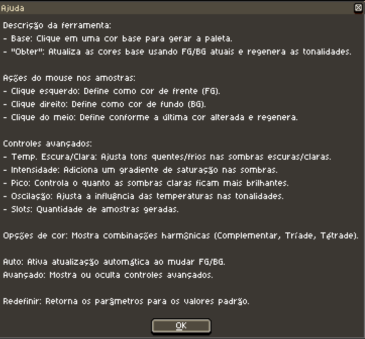
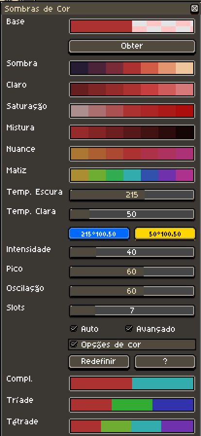

# Aseprite Color Shading v5.0

Este script para [Aseprite](https://www.aseprite.org/) abre uma janela dinâmica de seleção de cores com opções de gradiente e matiz, ajudando você a criar facilmente paletas e variações de sombreamento.

## Créditos e origens

Este trabalho é baseado em contribuições anteriores:

- Versão 1.0–2.0 por [Dominick John](https://github.com/dominickjohn/aseprite/tree/master) e [David Capello](https://aseprite.org/).
- Versão 3.0 por [yashar98](https://github.com/yashar98/aseprite/tree/main).
- Versão 3.1 por [Daeyangae](https://github.com/Daeyangae/aseprite).
- Versão 4.0 por [Manuel Hoelzl](https://github.com/hoelzlmanuel/aseprite-color-shading).

Esta versão mantém as funcionalidades introduzidas anteriormente, adicionando melhorias adicionais.

## Instalação

1. Baixe o arquivo do script (por exemplo, `Color Shading v4.0.lua`).
2. Abra o Aseprite e vá em **Arquivo -> Scripts -> Abrir pasta de scripts** para abrir o diretório de scripts.
3. Copie o arquivo do script para a pasta de scripts do Aseprite.
4. Reinicie o Aseprite se necessário.

## Uso

1. No Aseprite, vá em **Arquivo -> Scripts -> Color Shading v4.0** para executar o script.
2. Uma janela com diferentes seções de cores e opções de geração de paleta aparecerá.

### Funcionalidades:

- **Base:** Ao clicar em uma das cores base, as demais tonalidades e nuances são recalculadas com base nessa cor.
- **Botão "Obter":** Atualiza as cores base usando as cores atuais de primeiro plano (FG) e fundo (BG) e regenera as tonalidades.
- **Clique esquerdo em uma cor:** Define essa cor como FG.
- **Clique direito em uma cor:** Define essa cor como BG.
- **Clique do meio em uma cor:** Alterna entre FG/BG dependendo de qual foi alterado por último (se "auto" estiver habilitado) e regenera todas as tonalidades com a nova cor.
  
### Controles avançados:

- **Temperatura (Escuro/Claro):** Ajusta os desvios quentes/frios para sombras escuras e claras.
- **Intensidade:** Adiciona um gradiente de saturação às amostras de tonalidade.
- **Pico:** Adiciona um gradiente de luminosidade às tonalidades, afetando o quanto os tons claros ficam mais brilhantes.
- **Oscilação:** Ajusta o quanto as temperaturas influenciam nas cores finais.
- **Slots:** Altera o número de amostras de cor geradas.

## Notas

- Certifique-se de usar a versão mais recente do Aseprite para garantir compatibilidade com o script.
- Este script é destinado a artistas de pixel art e designers que precisam criar paletas e gradientes de cor rapidamente.

## 🌐 Outros idiomas

- 🇬🇧 [Versão em inglês](../../README.md)
- 🇫🇷 [Versão em francês](README-FR.md)
- 🇪🇸 [Versão em espanhol](README-ES.md)
- 🇯🇵 [Versão em japonês](README-JA.md)
